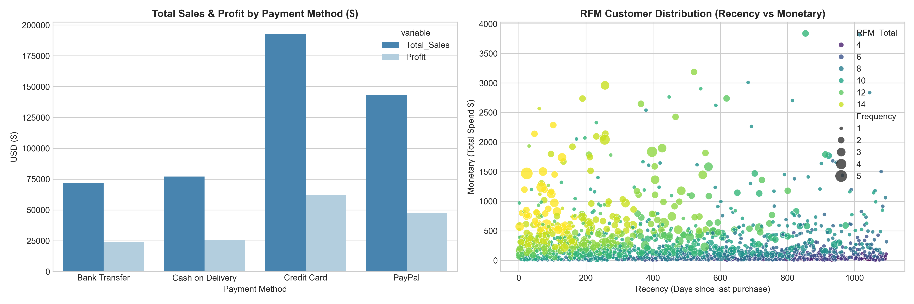

# 全球電商顧客留存與 RFM 數據分群分析

## 📌 專案摘要
本專案針對 2023–2025 年全球電商交易數據（涵蓋 2,000 筆訂單、1,534 位顧客）進行數據分析。專案結合 **MySQL 數據倉儲與建模**、**Python 數據 Quality Check** 與 **Tableau 視覺化儀表板**，旨在解決核心商業痛點：追蹤 Cohort 顧客流失趨勢，以及建立動態 RFM 顧客價值分群模型，提供行銷與營運策略。

---
這份專案是在幫這家電商找兩個答案：第一，客人買完一次之後，為什麼都不回來了？
                               第二，到底哪些人才是真正幫我們賺錢的 VIP？

## 🖼️ 視覺化儀表板 (Tableau Dashboard)


---

## 🛠️ 技術架構與資料驗收
* **工具鏈**：MySQL 8.0 (數據倉儲/分析) + Python (Data Validation) + Tableau Public (BI 視覺化)
* **UAT 資料品質查驗**：
  * **完整性**：2,000 筆訂單欄位無缺漏（Null Count = 0）。
  * **唯一性**：`Order_ID` 無重複值（Duplicate Count = 0）。
  * **合理性**：銷售金額與淨利均無負數異常值。

### 🐍 Python 數據探索驗證圖表


---

## 💻 核心 SQL 實作與語法
### 1. Cohort 留存計算 (MySQL)
```sql
WITH user_first_order AS (
    SELECT 
        Customer_Name,
        MIN(DATE_FORMAT(STR_TO_DATE(Order_Date, '%Y-%m-%d'), '%Y-%m-01')) AS first_month
    FROM ecommerce.global_ecommerce_sales
    GROUP BY Customer_Name
),
user_activities AS (
    SELECT 
        s.Customer_Name,
        f.first_month,
        PERIOD_DIFF(
            DATE_FORMAT(STR_TO_DATE(s.Order_Date, '%Y-%m-%d'), '%Y%m'),
            DATE_FORMAT(f.first_month, '%Y%m')
        ) AS month_number
    FROM ecommerce.global_ecommerce_sales s
    JOIN user_first_order f ON s.Customer_Name = f.Customer_Name
)
SELECT 
    first_month,
    month_number,
    COUNT(DISTINCT Customer_Name) AS active_users
FROM user_activities
GROUP BY first_month, month_number
ORDER BY first_month, month_number;

```
### 2. RFM 分群計算
```sql
WITH rfm_raw AS (
    SELECT 
        Customer_Name,
        DATEDIFF('2026-01-01', MAX(STR_TO_DATE(Order_Date, '%Y-%m-%d'))) AS recency,
        COUNT(DISTINCT Order_ID) AS frequency,
        SUM(Total_Sales) AS monetary
    FROM ecommerce.global_ecommerce_sales
    GROUP BY Customer_Name
),
rfm_scores AS (
    SELECT 
        Customer_Name,
        recency,
        frequency,
        monetary,
        NTILE(5) OVER (ORDER BY recency ASC) AS r_score,
        NTILE(5) OVER (ORDER BY frequency ASC) AS f_score,
        NTILE(5) OVER (ORDER BY monetary ASC) AS m_score
    FROM rfm_raw
)
SELECT 
    Customer_Name,
    recency,
    frequency,
    ROUND(monetary, 2) AS monetary,
    r_score, f_score, m_score,
    (r_score + f_score + m_score) AS rfm_total_score
FROM rfm_scores;
```
